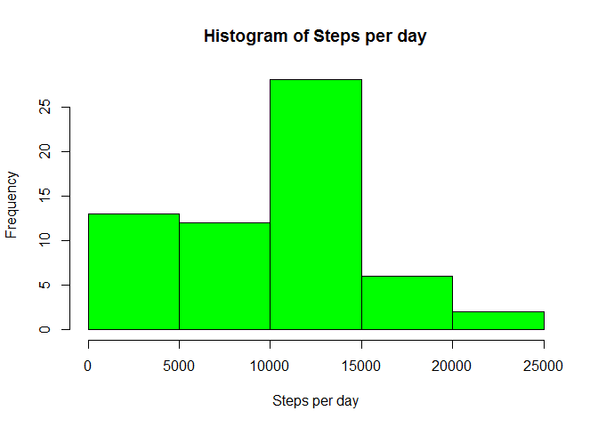
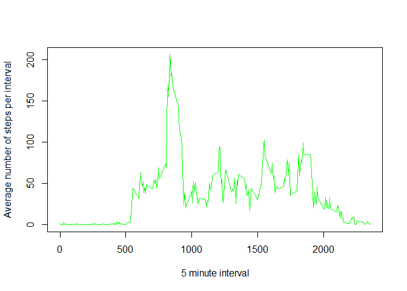
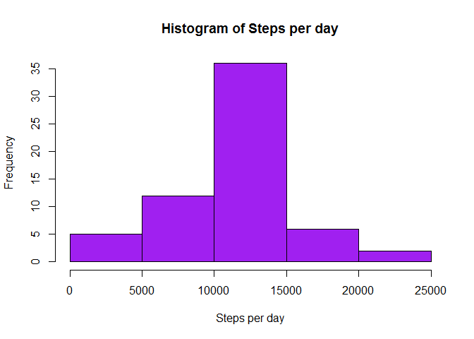

# Reproducible Research: Peer Assessment 1


## Loading and preprocessing the data

```r
amd <- read.csv(unz("activity.zip", "activity.csv"), stringsAsFactors = F)
amd$date <- as.Date(amd$date)
```

## What is mean total number of steps taken per day?

```r
StepsPerDay <- tapply(amd$steps, amd$date, sum, na.rm = T)
MeanSteps <- mean(StepsPerDay)
MedSteps <- median(StepsPerDay)

hist(StepsPerDay, col = "green",
     main = "Histogram of Steps per day",
     xlab = "Steps per day")
```

<!-- -->

The mean and median of the total number of steps per day are: 
9354.23 and 10395, respectively.


## What is the average daily activity pattern?

```r
MeanStepInterval <- tapply(amd$steps, amd$interval , mean, na.rm = T)
MaxInterval <- MeanStepInterval[MeanStepInterval == max(MeanStepInterval)]
MaxIntName <- names(MaxInterval)

plot(names(MeanStepInterval), MeanStepInterval, type = "l",
     ylab = "Average number of steps per interval",
     xlab = "5 minute interval",
     col = "green")
```

<!-- -->

The interval with the maximum average number of steps across all days is 
835 (with an average of 206.17 steps).


## Imputing missing values

```r
TotNAs <- sum(is.na(amd$steps))

Imputed_amd <- amd

# Impute the average (across all days) value for interval 
Imputed_amd[is.na(Imputed_amd$steps), "steps"] <- MeanStepInterval[
    as.character(Imputed_amd[is.na(Imputed_amd$steps), "interval"])]


ImStepsPerDay <- tapply(Imputed_amd$steps, Imputed_amd$date, sum, na.rm = T)
ImMeanSteps <- mean(ImStepsPerDay)
ImMedSteps <- median(ImStepsPerDay)

hist(ImStepsPerDay, col = "purple",
     main = "Histogram of Steps per day",
     xlab = "Steps per day")
```

<!-- -->

The total number of NAs are: 2304. 

The mean and median of the total number of steps per day when NA values
have been removed are: 10766.19 and 
10766.19, respectively.

The differences between the new mean and median compared to the ones that 
contained NAs are: 1411.96 and 
371.19 respectively. There is an increase for both 
of them, and hence also an increase in the estimate for the total daily 
number of steps.


## Are there differences in activity patterns between weekdays and weekends?

```r
weekend <- weekdays(Imputed_amd$date, abbreviate = T) %in% c("Sun","Sat")
Imputed_amd$daytype <- factor("weekday", levels = c("weekday","weekend"))
Imputed_amd[weekend,"daytype"] <- "weekend"

MeanStepIntWD <- aggregate(Imputed_amd$steps, 
                            by = list(Imputed_amd$interval, 
                                      Imputed_amd$daytype), mean)
names(MeanStepIntWD) <- c("interval","daytype","steps")

library(lattice)
xyplot(steps~interval|daytype, data = MeanStepIntWD, type = "l", layout = c(1,2))
```

<!-- -->
